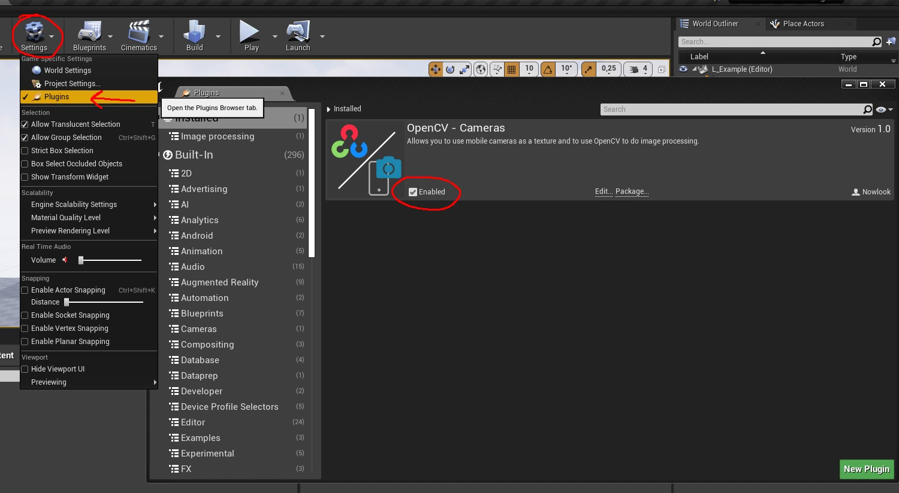
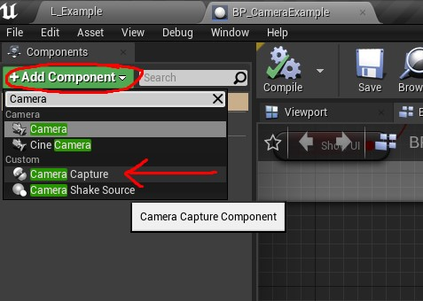
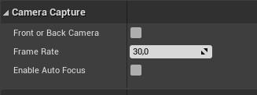
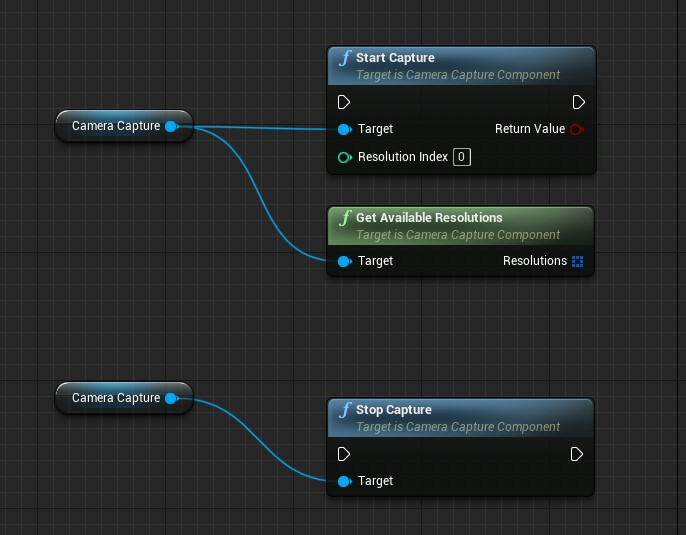
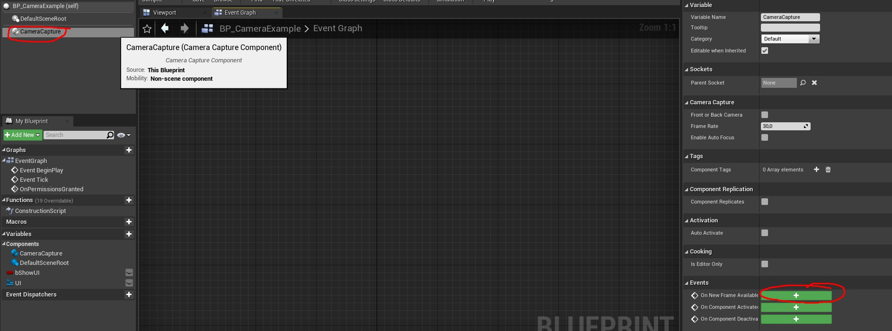

# **Documentation of the plugin OpenCV - Cameras**

## **Installation**
1. Get the plugin on the UE4 marketplace then simply install it via the Epic launcher for the engine version you want.
2. Once this step is done, you can open your UE4 projet, go to the plugins settings panel, then enable the "OpenCV - Cameras" plugin.

## **How to use**
### **CameraCapture component**
1. In an Actor, add the CameraCapture component.

2. Customize your CameraCapture component with the variables in the "CameraCapture" categorie.

3. Start and stop the capture with the StartCapture and StopCapture nodes.

4. Click on your CameraCapture component then, in the "Events" categorie, create the "OnNewFrameAvailable" event by clicking on the "+" green button.

This event will be called each time a new frame is available, so use it to update a material with the Texture2D or whatever you want. You can found an example map in the content plugin folder, feel free to test it!

### **OpenCV**

You can use OpenCV if you need to do some image processing. The library is already integrated in the plugin. Check out the Driver.h file (located in the [plugin folder]/Source/OpenCVCameras/Public/OpenCV/ folder) to know how to import OpenCV in your own file.

Don't forget to add the module dependency in your Build.cs file.